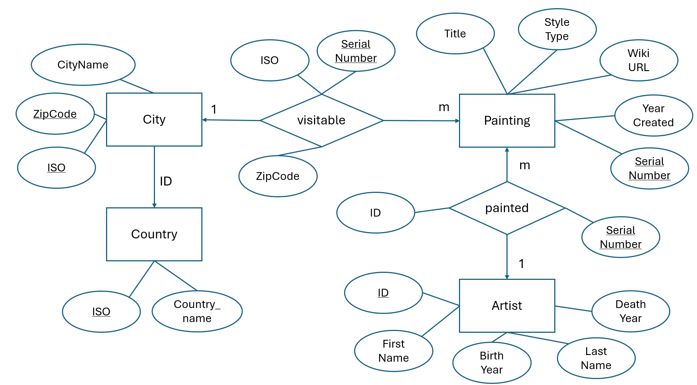

# [Project Name]

- [Name 1]
- [Name 2]
- [Name 3]

## Project Idea

The Painters & Paintings Management System is a database application designed to catalog famous artworks, their creators, and their locations. Users can search and filter paintings by multiple criteria such as country, city, artist, and artistic style. The system includes Wikipedia links for each painting, providing easy access to additional information about the artworks.
## ER Model

### Entity Types:
- **Country**: Represents countries using ISO codes (PK: iso, Attributes: country_name)
- **City**: Represents cities where paintings are located (PK: (country_iso, zipcode) - composite key, Attributes: name)
- **Artist**: Represents painters who created the artworks (PK: id, Attributes: first_name, last_name, birth_year, death_year)
- **Painting**: Represents individual artworks (PK: serial_number, Attributes: title, style_type, year_created, wikipedia_url)

### Relationship Types (with dedicated tables):
- **painted** (1:M): One Artist can create many Paintings (Table: painted with FKs artist_id, painting_serial_number)
- **visitable** (1:M): One City can have many Paintings (Table: visitable with FKs city_country_iso, city_zipcode, painting_serial_number)

### Cardinalities:
- Country → City: ID-dependency
- City (1) → Painting (M): One city can display multiple paintings
- Artist (1) → Painting (M): One artist can create multiple paintings

## Streamlit App Description

### 1. Input Forms (Data Entry)

The application provides three comprehensive data entry forms:

**a) Add Artist Form**
- First Name (required)
- Last Name (required)
- Birth Year (numeric input, range 1000-2024)
- Death Year (numeric input, 0 if alive)

**b) Add City Form**
- Zipcode (required, text input)
- City Name (required)
- Country (required, dropdown selection from existing countries)

**c) Add Painting Form**
- Painting Title (required)
- Style Type (required, dropdown with 16 predefined styles: Renaissance, Baroque, Rococo, Neoclassicism, Romanticism, Realism, Impressionism, Post-Impressionism, Expressionism, Cubism, Futurism, Surrealism, Abstract Expressionism, Pop Art, Minimalism, Contemporary)
- Year Created (numeric input, range 1000-2024)
- Wikipedia URL (optional)
- Artist (required, dropdown selection)
- City Location (required, dropdown selection)

### 2. Data Display (Queries)

The application provides multiple query views for exploring the database:

**View Data Page:**

1. **All Paintings Query**: 
   - Displays all paintings with JOIN across 6 tables (painting, painted, artist, visitable, city, country)
   - Shows: serial_number, title, style_type, year_created, artist_name, city_name, country_name, Wikipedia link
   - Sorted by serial number

2. **All Artists Query**:
   - LEFT JOIN with painted table and aggregation (COUNT) to show artist's painting count
   - Shows: id, first_name, last_name, birth_year, death_year, number_of_paintings
   - Sorted by last name

3. **All Cities Query**:
   - JOIN with country and LEFT JOIN with visitable table, includes COUNT aggregation
   - Shows: zipcode, name, country_name, paintings_count
   - Sorted by painting count (descending)

4. **Paintings by City**:
   - Filtered query with dynamic parameter binding using visitable table
   - User selects a city from dropdown, displays all paintings in that location
   - Shows: title, style_type, year_created, artist_name

5. **Paintings by Artist**:
   - Filtered query with dynamic parameter binding using painted table
   - User selects an artist, displays all their works
   - Shows: title, style_type, year_created, city_name, country_name

6. **Paintings by Style**:
   - Filtered query by artistic style with JOIN to painted and visitable tables
   - User selects a style, displays all matching paintings
   - Shows: title, year_created, artist_name, city_name

**Advanced Search Page:**

Multi-filter search with dynamic query building:
- **Filters**: Country (multiselect), City (multiselect), Artist (multiselect), Style (multiselect)
- **Query**: Complex SELECT with multiple JOIN operations (painted, visitable tables) and dynamic WHERE clauses
- **Display**: Results table with clickable Wikipedia links and summary statistics (total paintings, unique artists, unique styles)
- **Dynamic SQL**: Query adapts based on selected filters using parameterized queries for security

All queries use proper JOIN operations with the relationship tables (painted, visitable), parameterized queries for SQL injection prevention, and display results in formatted HTML tables with clickable Wikipedia links.

## Running the App

**Important:** Test that the following steps work:

1. `pip install -r requirements.txt`
2. `python setup_db.py`
3. `streamlit run streamlit_app.py`
